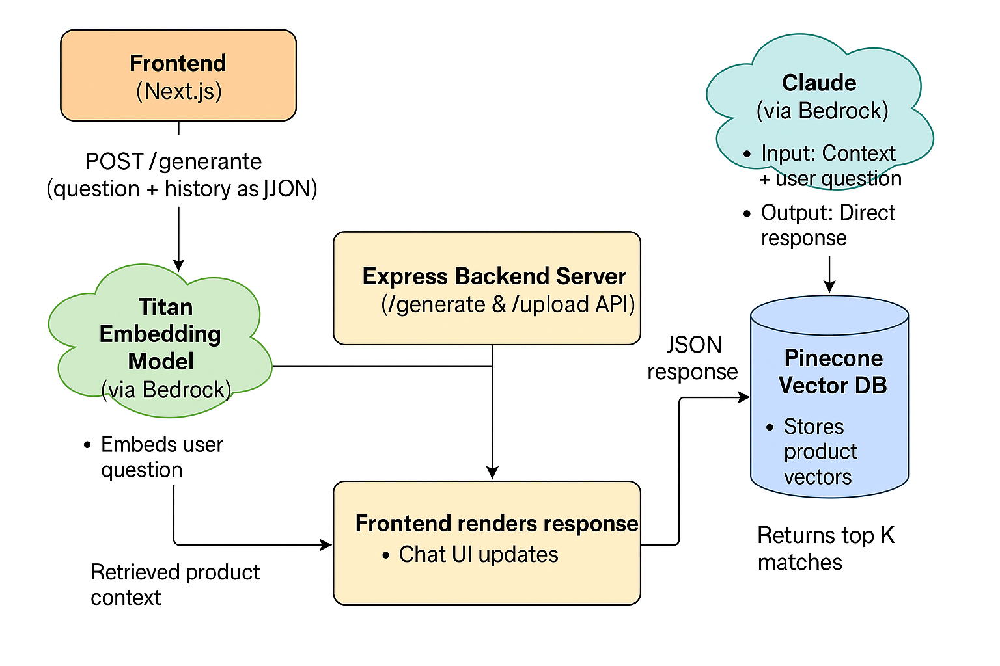

# 🛒 Smart Shopping Assistant (AI Chatbot for E-Commerce)

A smart AI-powered shopping assistant built with **Next.js (Frontend)**, **Express.js (Backend)**, **Amazon Bedrock (Titan Embedding + Claude)**, and **Pinecone Vector Database**. This chatbot answers customer queries confidently using retrieved product information.

---

## 🚀 Features

- 🔍 Context-aware product question answering  
- 🤖 Uses **Claude 3 Haiku** from Bedrock for natural language generation  
- 🧠 Embeds user questions using **Titan Embedding model**  
- 🗂 Stores product knowledge as vector embeddings in **Pinecone**  
- 🔄 Seamless API integration between frontend and backend  
- ⚡ Fast, secure, and scalable architecture  

---

## 📂 Project Structure

- `frontend/` – Next.js frontend
  - `pages/index.tsx` – Main chat interface
- `api/` – Express backend
  - `demo.js` – Express server with `/upload` route for vector embadding of data
  - `generate.js` – Upload script for embedding product data
- `data.json` – Sample product information to be embedded
- `.env` – Environment variables for AWS and Pinecone
- `README.md` – Project documentation

---

## 🧠 Architecture



1. **Frontend (Next.js)** sends user queries via `POST /generate`.
2. **Backend (Express)**:
   - Embeds the query using **Titan** from Bedrock.
   - Queries **Pinecone** to fetch the most relevant product info.
   - Sends the context + question to **Claude** via Bedrock.
3. **Claude** generates a direct, helpful response (no vague answers).
4. Response is returned and displayed in the chat UI.


1. **Frontend (Next.js)** sends user queries via `POST /generate`.
2. **Backend (Express)**:
   - Embeds the query using **Titan** from Bedrock.
   - Queries **Pinecone** to fetch the most relevant product info.
   - Sends the context + question to **Claude** via Bedrock.
3. **Claude** generates a direct, helpful response (no vague answers).
4. Response is returned and displayed in the chat UI.

---

## 🌐 Live Deployment

Frontend: [https://smart-shopping-assistant-awff.vercel.app](https://smart-shopping-assistant-awff.vercel.app)

Backend: Hosted separately (e.g., AWS EC2 / Render / Railway / Vercel Functions)

---

## 🧾 Setup Instructions

### 1. Clone the Repository

```bash
git clone https://github.com/yourusername/smart-shopping-assistant.git
cd smart-shopping-assistant
```

### 2. Install Dependencies

#### Frontend

```bash
cd frontend
npm install
```

#### Backend

```bash
cd api
npm install
```

### 3. Configure Environment Variables

Create a `.env` file in the `api` directory:

```env
AWS_REGION=your-region
AWS_ACCESS_KEY_ID=your-access-key
AWS_SECRET_ACCESS_KEY=your-secret-key

PINECONE_API_KEY=your-pinecone-key
PINECONE_INDEX_NAME=your-index-name
```

---

### 4. Upload Product Data to Pinecone

Make sure `data.json` contains objects with fields like:

```json
[
  {
    "title": "Wireless Earbuds",
    "content": "Noise-cancelling, Bluetooth 5.2, 24-hour battery life."
  }
]
```

Run the upload script:

```bash
cd api
node generate.js
# or visit http://localhost:3000/upload if hosted
```

---

### 5. Start the Servers

#### Frontend (Next.js)

```bash
cd frontend
npm run dev
```

#### Backend (Express API)

```bash
cd api
node generate.js
```

---

## 🛠️ Technologies Used

- **Frontend**: [Next.js](https://nextjs.org/) + TypeScript  
- **Backend**: [Express.js](https://expressjs.com/) + Node.js  
- **Vector Database**: [Pinecone](https://www.pinecone.io/)  
- **Embeddings**: [Amazon Titan Embeddings](https://docs.aws.amazon.com/bedrock/latest/userguide/model-titan-embed.html) via Bedrock  
- **LLM**: [Claude 3 Haiku](https://www.anthropic.com/news/claude-3-family) via Amazon Bedrock  
- **Cloud & APIs**: [Amazon Bedrock](https://aws.amazon.com/bedrock/)  
- **Styling**: [Tailwind CSS](https://tailwindcss.com/) *(optional)*  

---

## ✅ Sample API Request

### `POST /generate`

```json
{
  "messages": [
    { "sender": "user", "content": "Do these earbuds support wireless charging?" }
  ]
}
```

### ✅ Sample Response

```json
{
  "answer": "Yes, the wireless earbuds support Qi-enabled wireless charging."
}
```

---

## 📌 Notes

- Claude is instructed to **avoid vague language** and **answer confidently**.  
- Pinecone stores product embeddings for **semantic retrieval**.  
- Titan generates embeddings only from the **last user query**.  

---
